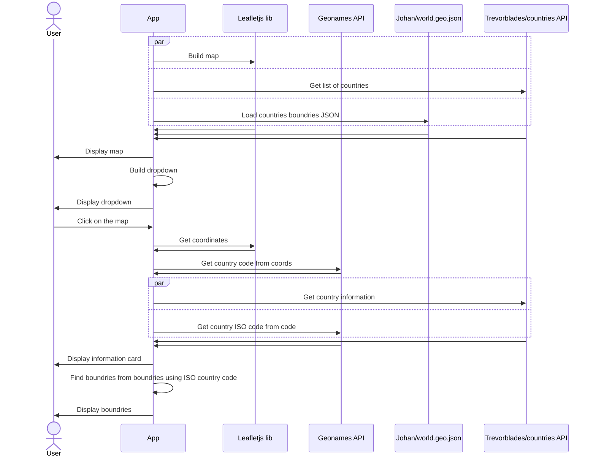

# Interactive Map app

Interactive map using GraphQL data from https://github.com/trevorblades/countries

### Checkout [Demo](https://stefanoantonel.github.io/interactive-map/) 🗺

<p>
  
  
</p>

## Getting Started

First, run the development server:

```bash
npm run dev
```

Open [http://localhost:3003](http://localhost:3003) with your browser to see the result.

## Improvements / TODOs

- Typescript for graphql queries
- Better cache mechanism
- Create PR to https://github.com/annexare/Countries adding divisions in CH, AR
- Add Sentry

## This source uses:

- https://github.com/trevorblades/countries for country infomation and list of countries
- https://leafletjs.com for interactive map and data provided by OpenStreetMap
- https://github.com/johan/world.geo.json for country boundries highlight
- https://www.geonames.org to obtain country based on coordinates and get also ISO country code
- https://react-select.com autocomplete dropdown for country selection

## Sequence Diagram

To understand a bit better the interaction with the libraries and different APIs see diagram.

<!-- prettier-ignore -->

